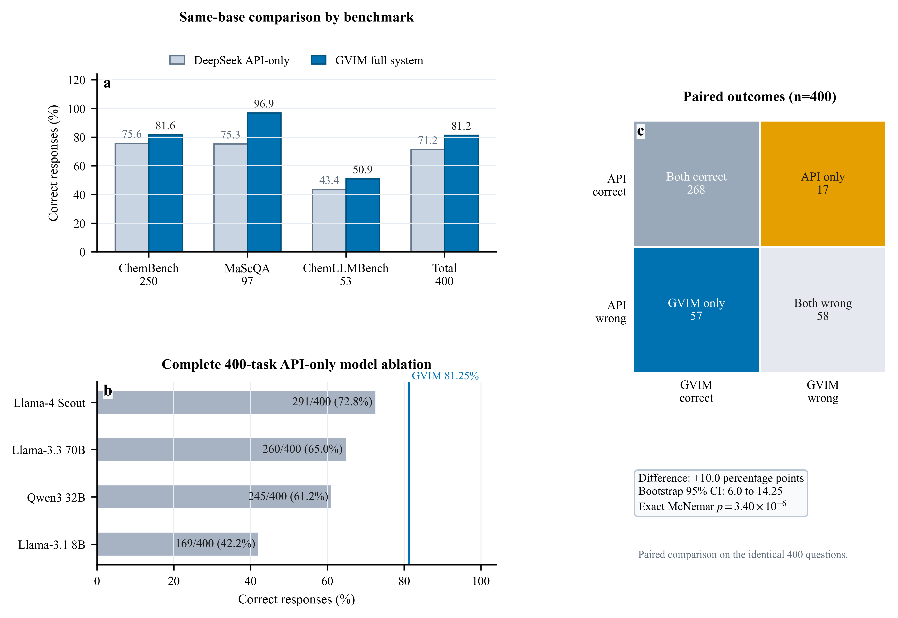
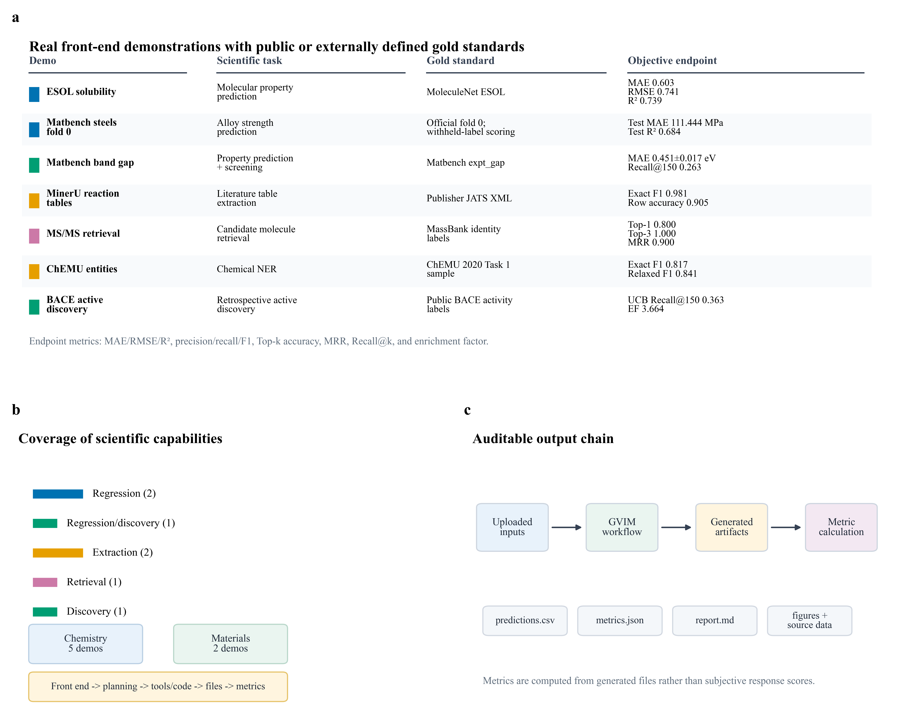
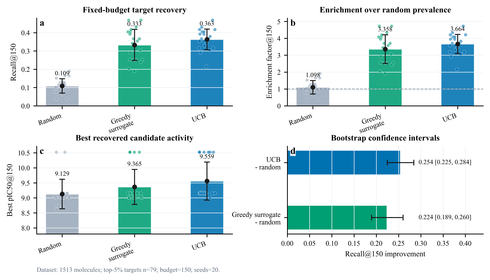
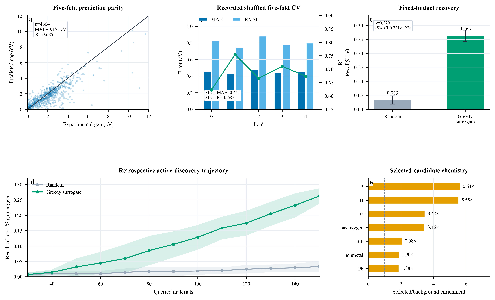
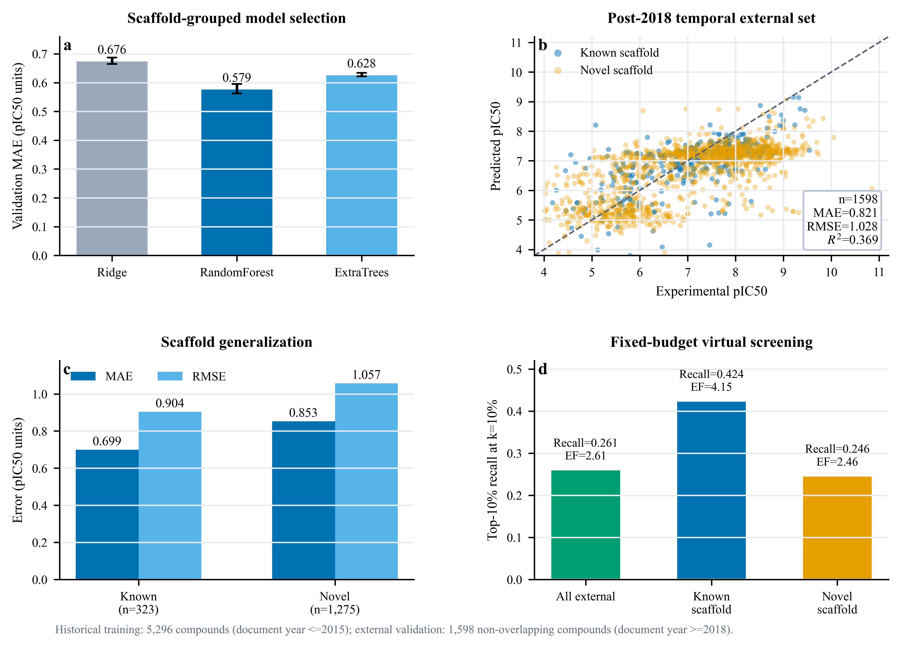

# GVIM 2.0: A Front-End Verified Scientific Agent System for Chemistry and Materials Research

GVIM 2.0 is a DeerFlow-based scientific-agent system designed for chemistry and materials research workflows. This repository contains the code snapshot, front-end verified demonstrations, manuscript source data, publication figures, Supporting Information, and reproducibility files associated with the GVIM 2.0 study.

The repository is organized to make the reported results auditable: the manuscript claims are linked to front-end submitted tasks, generated artifacts, source data, scoring records, and final publication figures.

## Demo Video

The GVIM 2.0 front-end workflow demonstration is available on YouTube:

[Watch the GVIM 2.0 demo video](https://youtu.be/wADY7T9_G-s)

A local packaged copy is also retained in the prepared release folder:

```text
media/Demo_Of_GVIM2.0.mp4
```

## Visual Summary


## Key Capabilities Demonstrated

GVIM 2.0 is evaluated through two complementary forms of evidence:

1. A paired 400-task benchmark comparing the full GVIM workflow against a same-base API-only setting.
2. Front-end initiated chemistry and materials case studies with objective endpoints, generated files, and reproducible scoring.

The front-end verified demonstrations include:

- ESOL solubility prediction
- Matbench steels strength prediction
- Matbench experimental band-gap workflow
- MinerU-assisted reaction table extraction
- MS/MS candidate retrieval
- ChEMU chemical entity extraction
- BACE active discovery
- BACE1 temporal external validation

## Main Figures

### Benchmark Performance



### Front-End Demonstrations



### BACE Active Discovery



### Matbench Band-Gap Case



### BACE1 Temporal External Validation



## Repository Layout

```text
.
|-- GVIM2.0-system/
|   |-- backend/                         # FastAPI / LangGraph / DeerFlow backend code
|   |-- frontend/                        # GVIM web front end
|   |-- skills/                          # Chemistry, materials, literature, plotting, and utility skills
|   |-- scripts/                         # Windows startup scripts
|   |-- config.example.yaml              # Example configuration
|   |-- extensions_config.example.json   # Example extension configuration
|   `-- start-deerflow-production.cmd    # Windows production startup entry point
|-- paper_frontend_verified_package/
|   |-- submission_files/                # Manuscript, Supporting Information, and evidence manifests
|   |-- frontend_thread_records/         # Archived front-end task inputs, scripts, and outputs
|   |-- publication_figures_600dpi/      # Final high-resolution publication figures
|   |-- source_data_and_results/         # Benchmark and figure source data
|   |-- posthoc_gold_scoring/            # Deterministic scoring records
|   `-- reproducibility_code/            # Final reproducibility scripts and demo code
|-- mcp/
|   `-- colab-mcp-main/                  # Colab MCP source snapshot
|-- figures/                            # README display copies of final figures
|-- RELEASE_FILE_MANIFEST.csv           # File-level release manifest
|-- ZIP_SHA256.txt                      # Checksum for the prepared zip archive
`-- PACKAGING_NOTES.md                  # Packaging and exclusion notes
```

## Manuscript and Supporting Information

Final manuscript files are provided in:

```text
paper_frontend_verified_package/submission_files/
```

Important files:

- `GVIM2.0.docx`
- `GVIM2.0.pdf`
- `GVIM2.0 Support Information.docx`
- `GVIM2.0 Support Information.pdf`
- `frontend_evidence_manifest.csv`
- `SHA256_MANIFEST_initial.csv`

## Starting GVIM 2.0 Locally

On Windows, start the packaged system from:

```bat
GVIM2.0-system\start-deerflow-production.cmd
```

The script delegates to:

```bat
GVIM2.0-system\scripts\start-deerflow-production-windows.cmd
```

Expected local services:

- Backend: `http://127.0.0.1:8001`
- Frontend: `http://localhost:3000`

Configure API keys through local environment variables or local configuration files. Do not commit real `.env` files.

## Reproducibility and Evidence

The evidence package is centered on front-end initiated runs. For each major demonstration, the archived records include the uploaded inputs, generated scripts, outputs, and scoring files.

Useful locations:

- Front-end task records: `paper_frontend_verified_package/frontend_thread_records/`
- Figure source data: `paper_frontend_verified_package/source_data_and_results/manuscript_source_data/`
- 400-task benchmark records: `paper_frontend_verified_package/source_data_and_results/benchmark_400_raw_records/`
- Final figure scripts: `paper_frontend_verified_package/reproducibility_code/manuscript_and_figure_scripts/`
- Demo code and data: `paper_frontend_verified_package/reproducibility_code/research_demos_code_data_results/`

## Data Integrity

The release includes:

- `RELEASE_FILE_MANIFEST.csv`: file list for the cleaned GitHub release directory.
- `paper_frontend_verified_package/SHA256_MANIFEST.csv`: checksum manifest from the front-end evidence package.
- `paper_frontend_verified_package/SHA256_MANIFEST_full_package.csv`: full evidence-package checksum manifest.
- `ZIP_SHA256.txt`: checksum for the prepared zip archive.

## What Was Intentionally Excluded

The public release excludes local-only or sensitive runtime state:

- `.env` files and real API keys
- `.deer-flow` runtime database, user memory, and private thread history
- `node_modules`, `.next`, virtual environments, caches, logs, and temporary build outputs
- large local model/data assets not required for manuscript evidence
- superseded figure drafts and intermediate manuscript-rendering files

See `PACKAGING_NOTES.md` for details.

## Security Note

The original local deployment contained private API keys in a local `.env` file. That file is not included in this release. Any keys previously stored in local plaintext should be rotated before making the repository public.

## Citation

If you use this repository, please cite the associated GVIM 2.0 manuscript once the paper or preprint is available.
