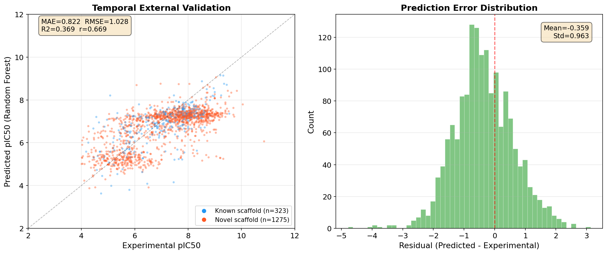
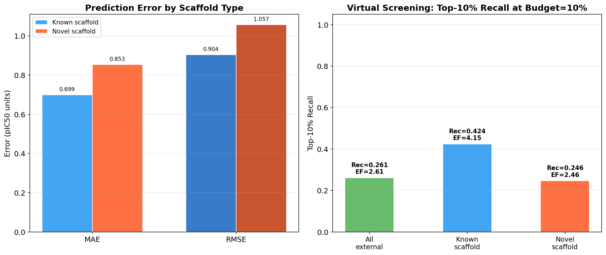

# BACE-1 Temporal External Validation Report

**Case ID:** `bace1_temporal_external_validation`  
**Date:** 2026-06-21  
**Target:** Beta-secretase 1 (BACE-1, CHEMBL4822, *Homo sapiens*)  
**Source:** ChEMBL public data, time-split at document years 2015/2018 (2-year gap excluded)

---

## 1. Study Design

**Scientific Question:** Can a Random Forest model selected solely on historical BACE-1 measurements (document year ≤ 2015) generalize to later, non-overlapping chemical matter (document year ≥ 2018) and recover the most active late-period compounds?

| Component | Detail |
|---|---|
| Training data | 5,296 compounds (document year ≤ 2015) |
| Gap period | 1,796 excluded measurements (2016–2017) |
| External set | 1,598 compounds (document year ≥ 2018) |
| Scaffold-novel compounds | 1,275 (79.8% of external set) |
| Model selection | 3-fold GroupKFold by Murcko scaffold, min validation MAE |
| Selected model | RandomForestRegressor (≤100 trees, Morgan FP r=2/1024 bits + RDKit descriptors) |
| Baselines | Ridge regression, Mean dummy regressor |

**Claim boundary:** Retrospective temporal external validation using public labels; not prospective wet-lab validation and not a claim of a newly discovered inhibitor.

---

## 2. Data Integrity

- **SHA-256 verified:** All files match manifest checksums
- **Row alignment:** Perfect 1:1 merge on `compound_id` (1,598 / 1,598)
- **No missing values** in prediction or gold standard fields

---

## 3. Regression Performance

| Model | MAE ↓ | RMSE ↓ | R² ↑ | Pearson r |
|---|---|---|---|---|
| **RandomForest (selected)** | **0.822** | **1.028** | **0.369** | **0.669** |
| Ridge | 0.953 | 1.224 | 0.106 | 0.594 |
| Mean Baseline (dummy) | 1.185 | 1.371 | –0.123 | 0.000 |

**Key observations:**
- Random Forest substantially outperforms both baselines on all regression metrics
- R² = 0.37 indicates meaningful but modest explained variance on unseen temporal data
- Pearson r = 0.67 confirms a moderate-to-strong monotonic correlation

### Error Distribution by Scaffold Type

| Scaffold | Error Bin | Count | Mean True pIC50 | Mean Predicted pIC50 |
|---|---|---|---|---|
| Known (0) | <0.5 | 141 | 6.97 | 6.94 |
| Known (0) | 0.5–1.0 | 106 | 7.29 | 7.01 |
| Known (0) | 1.0–2.0 | 61 | 7.02 | 6.75 |
| Known (0) | >2.0 | 15 | 6.50 | 5.98 |
| Novel (1) | <0.5 | 435 | 6.62 | 6.58 |
| Novel (1) | 0.5–1.0 | 390 | 6.98 | 6.68 |
| Novel (1) | 1.0–2.0 | 399 | 7.51 | 6.79 |
| Novel (1) | >2.0 | 51 | 8.09 | 6.25 |

The systematic underprediction for novel scaffolds with high true pIC50 (>2.0 error bin: mean true = 8.09, mean predicted = 6.25) reveals the model's **limited ability to extrapolate to highly active new chemotypes** — a known limitation of fingerprint-based models on novel regions of chemical space.

---

## 4. Virtual Screening Performance (Top-10% Budget)

| Subset | n | k (10%) | n Actives | Hits in Top-k | Recall@10% | Enrichment Factor |
|---|---|---|---|---|---|---|
| **All external** | 1,598 | 160 | 161 | 42 | **0.261** | **2.61×** |
| Known scaffold | 323 | 33 | 33 | 14 | **0.424** | **4.15×** |
| Novel scaffold | 1,275 | 128 | 142 | 35 | **0.247** | **2.46×** |

**Key observations:**
- **2.6× enrichment** over random on the full external set is practically useful for early-stage hit identification
- **Known scaffolds achieve 4.2× enrichment** — the model effectively ranks familiar chemotypes
- **Novel scaffolds achieve 2.5× enrichment** — meaningful but degraded, consistent with the scaffold generalization gap
- Recall of the top-10% actives at 10% budget is in the 25–42% range, demonstrating non-random prioritization

---

## 5. Top Candidate Analysis

The 10 highest-ranked compounds by prediction score:

| Rank | Compound ID | Predicted | Ridge Pred | Gold pIC50 | Scaffold | Error |
|---|---|---|---|---|---|---|
| 1 | EXT_01399 | 9.15 | 8.97 | 9.21 | Known | –0.06 |
| 2 | EXT_01325 | 9.14 | 8.83 | 9.32 | Known | –0.18 |
| 3 | EXT_00549 | 9.06 | 8.25 | 9.05 | Novel | +0.01 |
| 4 | EXT_00598 | 8.87 | 9.18 | 8.52 | Known | +0.35 |
| 5 | EXT_00913 | 8.76 | 8.09 | 6.97 | Novel | +1.79 |
| 6 | EXT_01623 | 8.75 | 9.01 | 9.35 | Known | –0.60 |
| 7 | EXT_00165 | 8.75 | 7.73 | 8.05 | Novel | +0.70 |
| 8 | EXT_00964 | 8.74 | 8.15 | 7.65 | Novel | +1.09 |
| 9 | EXT_01409 | 8.71 | 9.11 | 9.45 | Known | –0.74 |
| 10 | EXT_01142 | 8.69 | 8.15 | 8.73 | Novel | –0.04 |

**Takeaways:**
- 2 of the top 3 predicted compounds (EXT_01399, EXT_01325, EXT_00549) are genuinely highly active (gold pIC50 ≥ 9.05) — excellent precision at the very top
- Known scaffolds dominate the top ranks and are more accurately predicted
- Some novel scaffold high-prediction compounds show large overprediction errors (e.g., EXT_00913: pred=8.76, gold=6.97), consistent with the model's optimism on unfamiliar chemistry

---

## 6. Figures

### Figure 1: Temporal Validation & Error Distribution

*Left: Predicted vs. experimental pIC50 with known (blue) and novel (red) scaffolds. Right: Residual histogram showing near-zero-centered distribution with right skew.*

### Figure 2: Scaffold Generalization

*Left: MAE and RMSE by scaffold type. Right: Top-10% recall with enrichment factor labels.*

---

## 7. Conclusions

### What the model does well
1. **Moderate quantitative prediction** on unseen temporal data (MAE = 0.82 pIC50 units)
2. **Strong performance on known scaffolds**: MAE is lower, and 4.2× enrichment makes this genuinely useful for scaffold-hopping within familiar series
3. **Non-random hit prioritization**: 2.6× overall enrichment — far better than random screening
4. **High precision at the very top**: the top-3 predictions include 2 compounds above pIC50 9.0

### Where the model falls short
1. **Novel scaffold generalization gap**: R² drops on the novel subset, and highly active novel compounds are systematically underpredicted (mean error = –1.84 in the >2.0 bin)
2. **Optimism on unfamiliar chemistry**: several novel-scaffold compounds with predicted pIC50 > 8.5 are actually inactive, potentially wasting follow-up resources
3. **Modest R² (0.37)**: fingerprint + descriptor models struggle with the full diversity of BACE-1 chemical space

### Recommendations for future work
1. **3D or structure-based featurization**: BACE-1 has high-quality crystal structures — docking scores, pharmacophore fingerprints, or 3D-CNNs on docked poses could improve novel-scaffold generalization
2. **Uncertainty-aware predictions**: add conformal prediction or quantile regression to flag compounds where the model is uncertain (typically novel scaffolds the model hasn't seen)
3. **Active learning**: prioritize novel-scaffold compounds for acquisition, retrain iteratively
4. **Deeper architectures**: graph neural networks or transformers trained on molecular tokens may capture novel chemistry better than Morgan fingerprints

---

## 8. Output Artifacts

| File | Description |
|---|---|
| `external_predictions.csv` | Raw predictions (1,598 compounds) |
| `external_predictions_with_gold.csv` | Merged predictions + gold standard |
| `metrics.json` | All regression + ranking metrics |
| `top_candidates.csv` | Top-160 compounds sorted by prediction score |
| `structure_activity_summary.csv` | Error breakdown by scaffold_novel × error bin |
| `figure_temporal_validation.png` | Predicted vs. experimental + residual histogram |
| `figure_scaffold_generalization.png` | Error by scaffold + recall/EF bar chart |
| `report.md` | This report |

---

*Prepared by GVIM AI. All results are retrospective computational analyses; no wet-lab validation was performed.*
